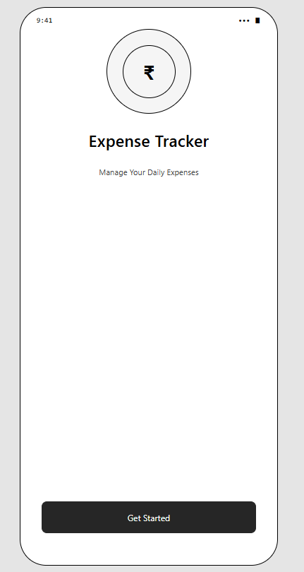
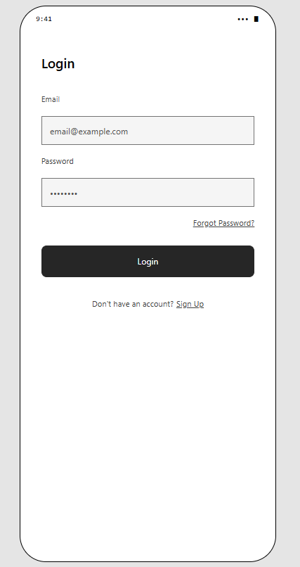
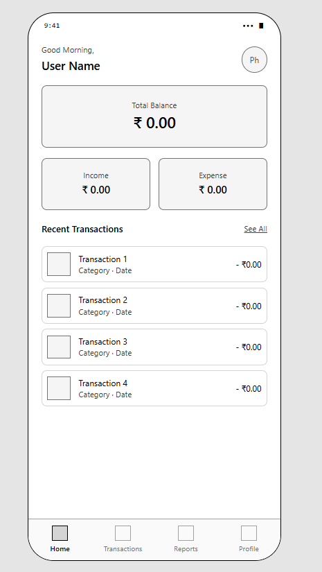
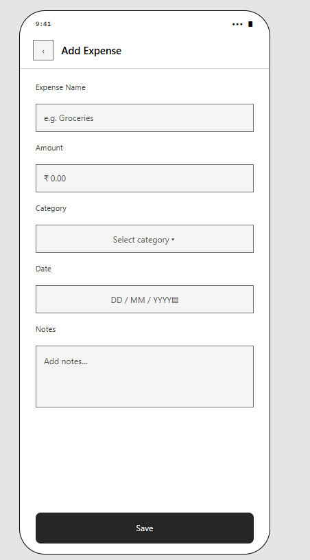
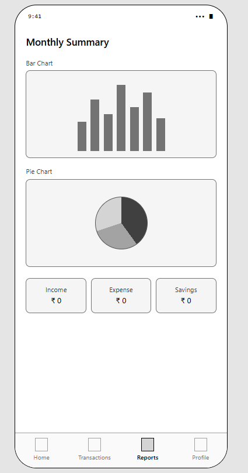
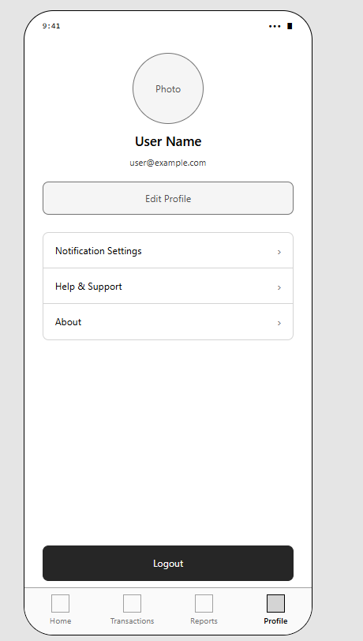

# Expense Tracker - Mobile App Wireframing

## Overview

This project contains low-fidelity wireframes for a mobile Expense Tracker application created as part of the Mobile App Wireframing assignment.

## Features

- Splash Screen
- Login Screen
- Home Dashboard
- Add Expense
- Reports
- Profile

## Tools Used

- Figma

## Wireframe Screens

- Splash Screen
- Login Screen
- Home Dashboard
- Add Expense
- Reports
- Profile

## Project Structure

```
Expense-Tracker-Wireframe/
├── README.md
├── Mobile_App_Wireframing_Report.docx
└── Screenshots/
```
## Screenshots

### Splash Screen


### Login Screen


### Home Dashboard


### Add Expense


### Reports


### Profile

